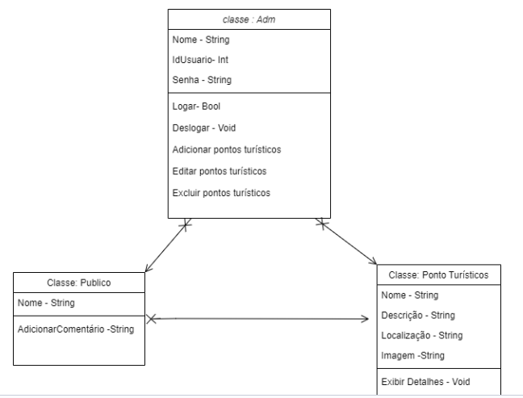
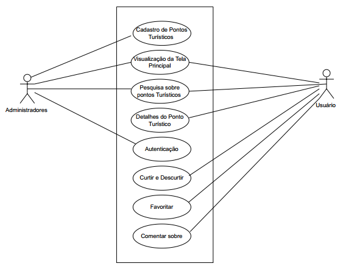
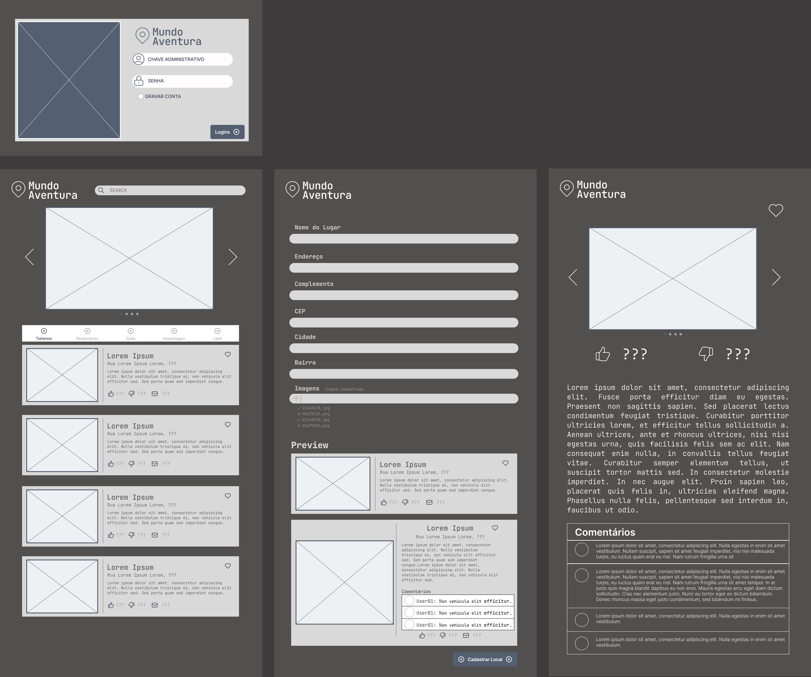

# Mundo Aventura

 O objetivo principal deste site é fornecer aos viajantes uma plataforma interativa e informativa para explorar lugares turísticos de uma maneira mais envolvente e personalizada.

## Funcionalidades do projeto

- Exploração Personalizada: O site terá uma barra de pesquisas, onde os usuários podem inserir o nome da cidade que desejam explorar.
- Avaliações e Comentários: Os usuários podem ler avaliações e comentários de outros viajantes sobre os lugares que desejam visitar. Eles também podem deixar suas próprias avaliações e dicas para compartilhar suas experiências.
- Informações Úteis: Além das atrações turísticas, o site fornece informações práticas, como horários de funcionamento, preços de ingressos, números de telefone úteis e dicas de transporte.
- Galerias de Fotos: O site terá galerias de fotos para que os usuários possam ver fotos de lugares antes de visitá-los

- Atualizações em Tempo Real: O site pode ser atualizado regularmente com eventos e informações em tempo real.

<<<<<<< HEAD

=======
##My SQL:
- Local: Table
-ID: Collum
-NOMELOCAL: Collum
-ENDERECO: Collum
-COMPLEMENTO: Collum
-CEP: Collum
-CIDADE: Collum
-BAIRRO: Collum

![TEXTO ALT...].(/Diagrama/diagrama-1.png).
>>>>>>> 50e22c2f95e47a556bcf20b74efca8d91d45f8e2
